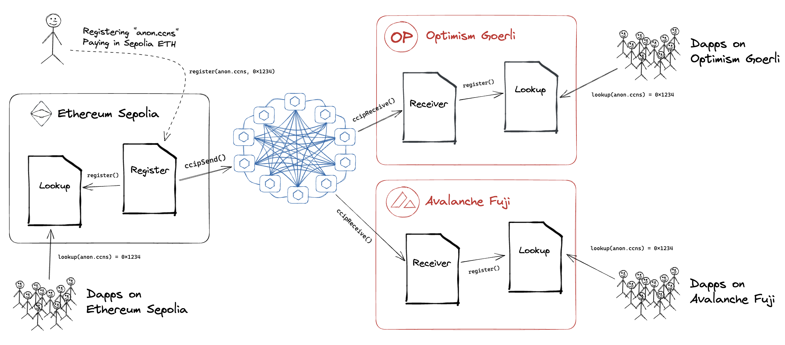

## CCIP Starter Kit

**INTERNAL ONLY, WORK IN PROGRESS**

_This repository represents an example of using a Chainlink product or service. It is provided to to help you understand how to interact with Chainlink’s systems so that you can integrate them into your own. This template is provided "AS IS" without warranties of any kind, has not been audited, and may be missing key checks or error handling to make the usage of the product more clear. Take everything in this repository as an example and not something to be copy pasted into a production ready service._

### Example #1: Immutable :telephone_receiver:

### Example #2: Ping Pong :ping_pong:

### Example #3: Cross-Chain Name Service :mailbox_with_mail:

